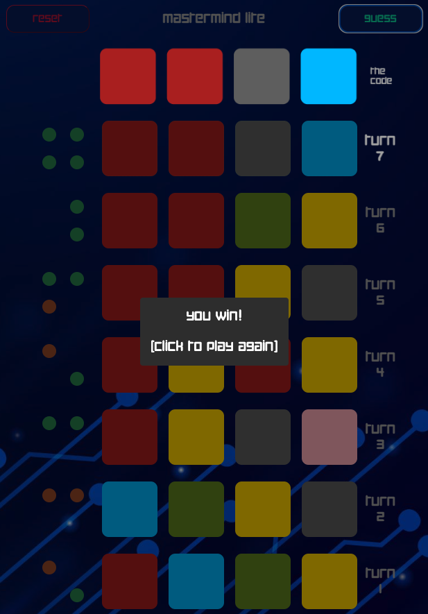

# [Mastermind Lite](https://dearthtacular.github.io/Mastermind-Lite/)

Thank you for selecting Mastermind Lite for all of your entertainment needs.  Mastermind Lite is playable in modern browsers and was created using JavaScript, HTML, and CSS.

For a history of the original Mastermind, please visit [wikipedia](https://en.wikipedia.org/wiki/Mastermind_(board_game)).

There are some distinct differences between the original Mastermind and Mastermind Lite:

Original Mastermind was created as a two player game.  Players score points only when they play the role of the code maker.  Since the role of code maker is filled by the computer in Mastermind Lite, another schema is necessary:

There are no points in Mastermind Lite.  Rather, the player _(the code breaker)_ has ten possible turns to guess the code generated by the computer _(the code maker)_.  If the code is guessed in ten turns or less, the player wins.  If the player does not guess the code in ten turns, the player loses.

Mastermind Lite does not keep track of rounds won, and there are no accumulated credits or totals from one playthrough to the next.  Mastermind Lite is designed to be a quick playing experience while providing an enjoyable challenge for the player.

## Concept

At the launch of the game, the code maker will automatically generate and hide a code of four colored squares for the player to guess.  The code can comprise any combination of the playable colors.  The code maker cannot have a blank or null as one of its color choices.

>__Note__: The code generated by the code maker can include multiple instances of the same color up to, and including, all squares.  

The goal of the game is for the player to guess the code generated by the code maker by placing colored squares in the same vertical position as the code maker's code.

## Instructions

1. The player selects a color for each playable square by clicking repeatedly to toggle through all available color selections.  After selecting a color in each square, the player then clicks the __guess__ button to submit their guess for evaluation by the reporting function and advance to the next turn.  Note that the __guess__ button will not activate until the player selects a color for every playable square for the current turn.

2. Once the player clicks the __guess__ button, the game will:
- Automatically display an empty row for the next turn
- Advance the row for the prior turn down the board
- Provide a report for the accuracy of the guesses in the prior turn.  The report will appear to the left of the prior turn's row in a matrix of four possible report dots

The report dots have the following meanings:

Green: The player selected a color that appears in the correct vertical position relative to the code maker's code.

Orange: The player selected a color that appears somewhere in the code maker's code, but it is located in an incorrect vertical position.

No dot / dot absent:  The player selected a color that is not present in the code maker's code.
 

>__Note__: The report dot locations are not fixed relative to the vertical locations guessed by the player.  In other words, if a guess yields a green dot in the __upper left__ quadrant of the reporting field, an _identical_ guess may yield a green dot in the __lower right__ quadrant of the reporting field.  All dot locations are randomized each turn.  The code maker is saying, "One color is in the correct location, but I'm not saying which one or where."

## Examples

### Turn one

The player selected four random colors.  The report states that two colors present in the player guess are in the code maker's code, with one in the correct location (green dot), one in an incorrect location (orange dot), and two colors are not present in the code maker's code at all (no dot).

### Turn two

The player selected three of the four colors chosen in turn one and added one more to the row.  The color that resulted in a green dot in turn one has either moved or been removed.

### Turn three

and so on...

Upon completing the game (win or lose), the code created by the code maker is revealed.

## Icebox Items

There are future options that are designed to adjust the level of difficulty for the player:

1. The ability to select no color (blank) as a guess option
2. Similar to the ability to select no color, the ability to add colors to the palette of possible guess options
3. The ability to increase or decrease the number of guess rows (turns) per game

## Credits

Background image by <a href="https://www.freepik.com/free-vector/gradient-futuristic-background-with-connection-concept_18777126.htm#query=electronic%20background&position=2&from_view=keyword&track=ais&uuid=2c59befd-5342-4f3b-94f5-05b6ccb80e80">Freepik</a>